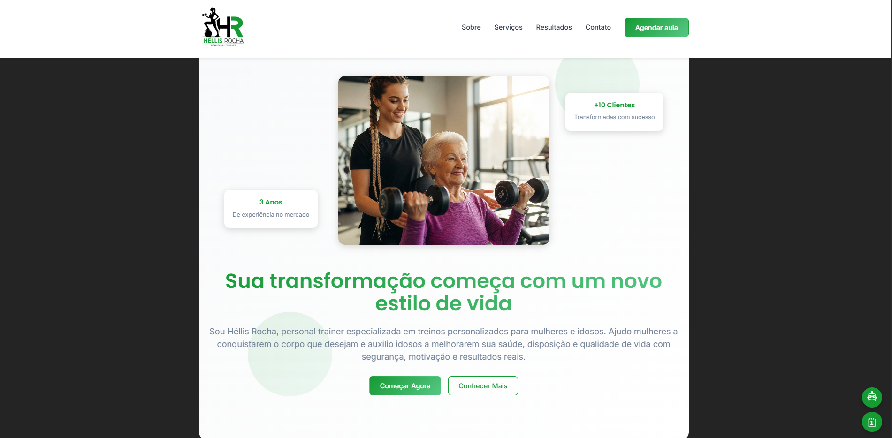

# Site Personal Trainer Feminino - Héllis Rocha


Site profissional para personal trainer, desenvolvido para apresentar os serviços oferecidos, destacar resultados reais de alunas e facilitar o contato e agendamento de aulas.



## ✨ Funcionalidades

-  **Hero responsivo** com imagem e chamada de ação clara
-  **Design responsivo** para mobile, tablet e desktop
-  **Formulário de contato funcional** via **EmailJS**
-  **Calendário com agendamento de data e horário**, que redireciona para o formulário com os dados preenchidos
-  **Chatbot flutuante simples** para interação com usuários
-  Sessão de **depoimentos e transformações reais**
-  Galeria de imagens com **serviços oferecidos** e exemplos de treinos
-  Mapa de localização embutido (Google Maps)
- **Menu hambúrguer** para dispositivos móveis
- **Animações suaves** e micro-interações


---

## 🛠️ Tecnologias Utilizadas

- [React](https://react.dev/)
- [TypeScript](https://www.typescriptlang.org/)
- [Styled-Components](https://styled-components.com/)
- [React Hook Form](https://react-hook-form.com/) (para manipulação de formulários)
- [React-Datepicker](https://reactdatepicker.com/) (para seleção de data/hora)
- [EmailJS](https://www.emailjs.com/) (envio de formulários por e-mail)
- [React-Icons](https://react-icons.github.io/react-icons/)
- [Vite](https://vitejs.dev/) (ambiente de build)

---

## 📱 Seções do Site

1. **Header** - Navegação fixa com menu hambúrguer para mobile
2. **Hero** - Seção principal com call-to-action
3. **Sobre Mim** - Informações da personal trainer e certificações
4. **Serviços** - Cards com diferentes planos de treino
5. **Resultados** - Depoimentos de clientes e transformações
6. **Contato** - Formulário de contato e informações
7. **Footer** - Links e informações adicionais

## 🚀 Como Rodar o Projeto

### Pré-requisitos
- Node.js 18+ 
- npm ou yarn

1. **Clone o repositório**
```bash

git clone https://github.com/ThiaraFernandes/landing-page-personal-trainer.git
cd helis-rocha-personal-trainer

# Instalar dependências
npm install

# Executar em modo desenvolvimento
npm run dev

```

## 📁 Estrutura do Projeto

```
src/
├── components/
│   ├── Header/
│   ├── Hero/
│   ├── About/
│   ├── Services/
│   ├── Results/
│   ├── Contact/
│   └── Footer/
├── styles/
│   ├── theme.ts
│   └── GlobalStyles.ts
└── App.tsx
```

## 📞 Contato

Site desenvolvido por Thiara Fernandes - Desenvolvedora Front End
- [💼 LinkedIn](https://www.linkedin.com/in/thiarafernandes/)
- [📧 Email](mailto:thiararfernandes@gmail.com)


---


